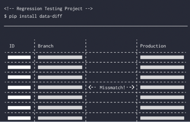

#### **data-diff** enables data professionals to detect differences in values between any two tables.
It's fast, easy to use, and reliable--even at massive scale.

[Join us on GitHub](https://github.com/datafold/data-diff#readme) if you'd like to contribute to this open source library!

* ⇄  Verifies across [many different databases][dbs] (e.g. PostgreSQL ⇄ Snowflake) or within a database
* 🔍 Outputs [diff of rows](#example-command-and-output) in detail
* 🚨 Simple CLI/API to create monitoring and alerts
* 🔁 Bridges column types of different formats and levels of precision (e.g. Double ⇆ Float ⇆ Decimal)
* 🔥 Verify 25M+ rows in <10s, and 1B+ rows in ~5min.
* ♾️  Works for tables with 10s of billions of rows

## Common use-cases

### Validation of replication, migration, and pipelines

* **Verify data migrations.** Verify that all data was copied when doing a
  critical data migration. For example, migrating from Heroku PostgreSQL to Amazon RDS.
* **Verify data pipelines.** Moving data from a relational database to a
  warehouse/data lake with Fivetran, Airbyte, Debezium, or some other pipeline.
* **Maintain data integrity SLOs.** You can create and monitor
  your SLO of e.g. 99.999% data integrity, and alert your team when data is
  missing.
* **Debug complex data pipelines.** Data can get lost in pipelines that
  may span a half-dozen systems. **data-diff** helps you efficiently track down 
  where a row got lost without needing to individually inspect intermediate datastores. 
* **Detect hard deletes for an `updated_at`-based pipeline**. If you're
  copying data to your warehouse based on an `updated_at`-style column, **data-diff** 
  can find any hard-deletes that you may have missed.
* **Make your replication self-healing.** You can use **data-diff** to
  self-heal by using the diff output to write/update rows in the target
  database.

### Comparing tables within one database to validate successful transformaitons

* **Inspect differences between branches**. Make sure your code results in only expected changes.
* **Validate stability of critical downstream tables.** When refactoring a data pipeline, rest assured
that the changes you make to upstream models has not impacted critical downstream models depended on
by users and systems.
* **Conduct better code reviews.** No matter how thoughtfully you review the code, run a diff to 
ensure that you don't accidentally approve an error.