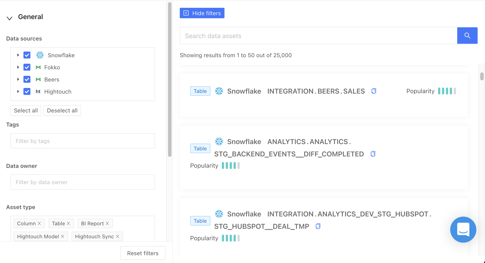
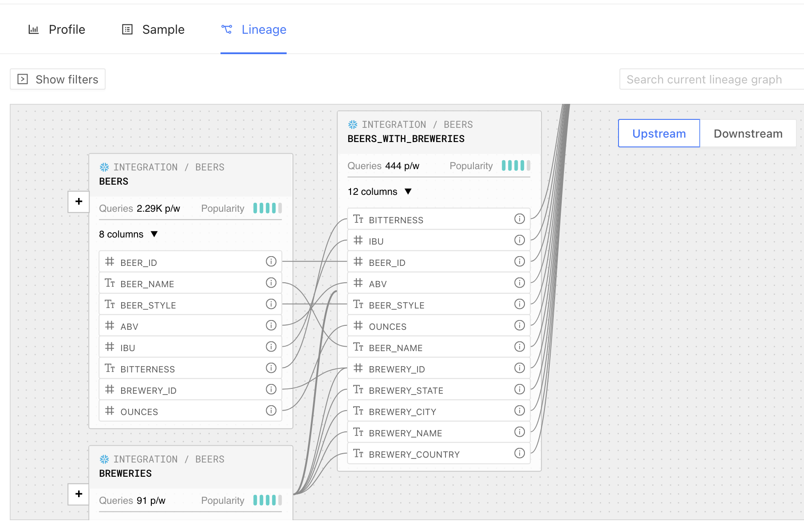

## Catalog

With the Datafold Catalog, you can quickly see row counts, nulls, and column distributions for tables in your data warehouse.

To include more details in your Catalog, you can sync metadata from dbt and your data warehouse to create a single source of truth. You can implement custom tags to easily categorize and filter the data sets. 

## Column-level Lineage

After connecting your data warehouse, Datafold parses the query logs to construct and visualize dependencies at both the table and column levels. See how data is produced, consumed, and transformed. Datafold supports complex queries, such as correlated subqueries, `CASE WHEN` statements, and window functions.

No additional developer resources are needed to unlock this capability. Simply connect your data warehouse and explore your lineage graph. 

To view the column-level Lineage of any table in your warehouse:

* Navigate to Catalog.
* Click on any table in the Catalog.
* Click on the Lineage tab.
* By default, table-level lineage will be shown. 
* Click on the Columns dropdown of any table to view column-level lineage.