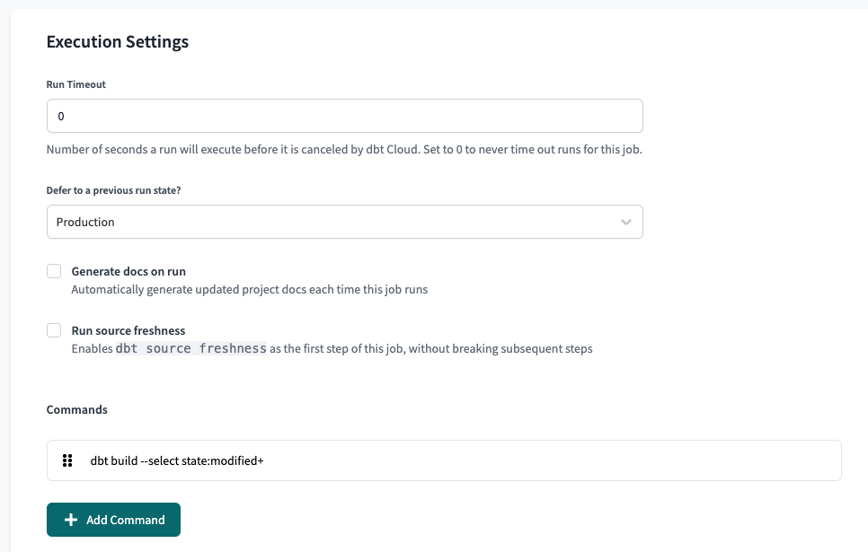

### Slim CI
[Slim CI](https://docs.getdbt.com/docs/dbt-cloud/using-dbt-cloud/cloud-enabling-continuous-integration#configuring-a-dbt-cloud-ci-job) speeds up CI by running only your changes.

  * Quick primer on [state:modified](https://docs.getdbt.com/reference/node-selection/methods#the-state-method) syntax:
      * `state:modified+` run the modified model(s) and all downstream models
      * `state:+modified` run the modified model(s) and all upstream models
      * `state:modified+n` run the modified model(s) and N downstream models


* Navigate to Jobs > Settings > Execution Settings
* Under "Defer to a previous run state?", select the production job
    * This may or may not be labelled "Production" it is based on the name you chose when creating the job
* Alter the command, adding `--select state:modified+`




### Autoscaling CI

Although a great addition to your CI, [Slim CI](#slim-ci) has the following limitations:

* Only one Slim CI job can run at a given time.
* A job will continue to run even if another commit is added to the pull request.

[Autoscaling CI](https://docs.getdbt.com/blog/intelligent-slim-ci#the-solution-autoscaling-ci) addresses both limitations. New commits to an existing pull request will cancel any in progress runs for that pull request. In addition, it can use the same Slim CI job definition to run separate pull requests in parallel.

For detailed setup instructions, see [this post](https://docs.getdbt.com/blog/intelligent-slim-ci#setup) from the dbt Developer Blog.

### Merge Trigger Production Job
To set up continuous deployment of your data with dbt Cloud, we recommend creating a job that triggers a dbt Cloud production run when changes are pushed to main.

Then, select this job as the "Job that creates dbt artifacts" when setting up your dbt Cloud Integration.

```mdx-code-block
import DbtArtifacts from '../../../static/img/job_that_creates_artifacts.png';

```
<center></center>

* **Why?**
    * To deploy new changes from pull requests immediately.
    * This will keep production up to date and enable accurate Datafold diffs.
    * By default, dbt Cloud runs the production job on a schedule, not on merges.


Example [Github Action](../ci_guides/dbt_core/github_actions.md):
```yml
name: Trigger dbt Cloud

on:
  push:
    branches:
      - main

jobs:
  run:
    runs-on: ubuntu-20.04
    timeout-minutes: 15

    steps:
      - name: checkout
        uses: actions/checkout@v2

      - name: Trigger dbt Cloud job
        run: |
          output=$(curl -X POST --fail \
            --header "Authorization: Token ${DBT_API_KEY}" \
            --header "Content-Type: application/json" \
            --data '{"cause": "Commit '"${GIT_SHA}"'"}' \
            https://cloud.getdbt.com/api/v2/accounts/${ACCOUNT_ID}/jobs/${JOB_ID}/run/)

          echo "Triggered dbt Cloud run at:"
          echo ${output} | jq -r .data.href
        env:
          DBT_API_KEY: ${{ secrets.DBT_API_KEY }}
          ACCOUNT_ID: 1234 # dbt account id
          JOB_ID: 4567 # dbt job id of the production tables
          GIT_SHA: "${{ github.ref == 'refs/heads/master' && github.sha || github.event.pull_request.head.sha }}"
```
You need to add the dbt Cloud API key as a secret in GitHub Actions, and you need to set the IDs of the account and the job id that builds the production job. You can find these easily in the dbt Cloud UI:

