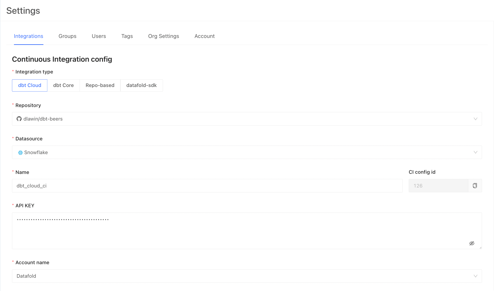
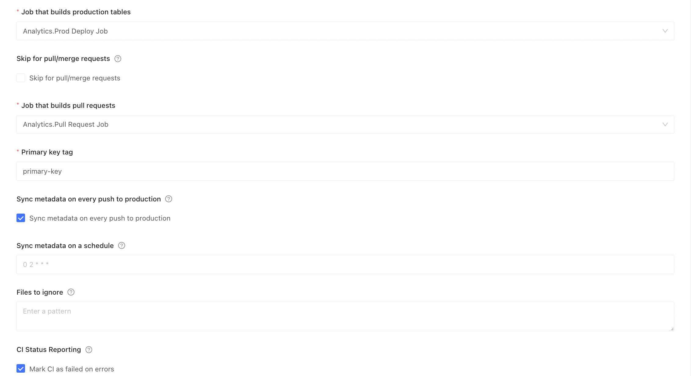
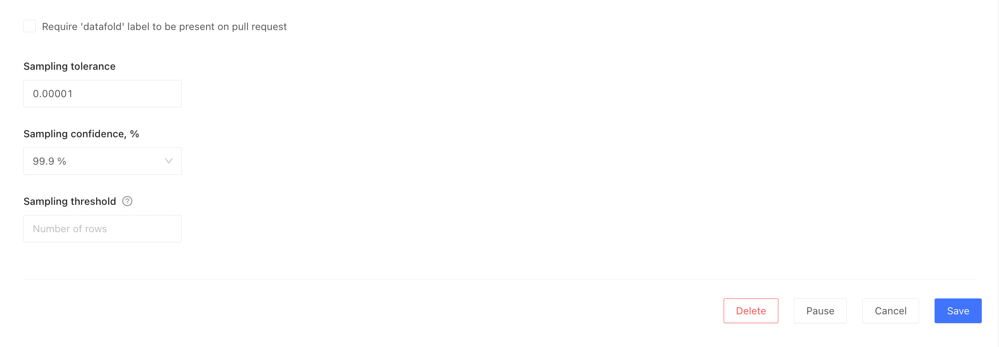

* [Prerequisites](dbt_cloud.md#prerequisites)
* [Basic Config](dbt_cloud.md#basic-config)
    * [Scheduled Production Job](dbt_cloud.md#scheduled-production-job)
    * [Merge Trigger Production Job](dbt_cloud.md#merge-trigger-production-job)
    * [Pull Request Job](dbt_cloud.md#pull-request-job)
* [Datafold Config](dbt_cloud.md#datafold-config)
* [Advanced Config](dbt_cloud.md#advanced-config)
    * [Pull Request Job](dbt_cloud.md#advanced-pull-request-job)

## Prerequisites

    You will need an API key for a dbt Cloud user whose account will be used for the integration. 
    Their name will show up in the pull/merge request. 
    You can either create a "synthetic" user "team@yourcompany.com" or use one of the existing accounts.

## Basic Config

### Scheduled Production Job

Create a scheduled job (e.g. every 24 hours) in dbt cloud
* **Why?**
    * To refresh models every night
    * Table models should be rematerialized with fresh data


* Navigate to Jobs > Settings > Execution Settings
* Under Commands, add a `dbt build` command:


* Navigate to Jobs > Settings > Triggers > Schedule
* Select "Run on schedule"
* Complete the scheduling form for your desired schedule:


### Merge Trigger Production Job
Create a job that triggers a dbt Cloud production run when changes are pushed to main
* **Why?**
    * To deploy new changes from pull requests immediately
    * This will keep production up to date and enable accurate Datafold diffs
    * By default, dbt Cloud runs the production job on a schedule, not on merges


Example [Github Action](dbt_core/github_actions.md):
```yml
name: Trigger dbt Cloud

on:
  push:
    branches:
      - main

jobs:
  run:
    runs-on: ubuntu-20.04
    timeout-minutes: 15

    steps:
      - name: checkout
        uses: actions/checkout@v2

      - name: Trigger dbt Cloud job
        run: |
          output=$(curl -X POST --fail \
            --header "Authorization: Token ${DBT_API_KEY}" \
            --header "Content-Type: application/json" \
            --data '{"cause": "Commit '"${GIT_SHA}"'"}' \
            https://cloud.getdbt.com/api/v2/accounts/${ACCOUNT_ID}/jobs/${JOB_ID}/run/)

          echo "Triggered dbt Cloud run at:"
          echo ${output} | jq -r .data.href
        env:
          DBT_API_KEY: ${{ secrets.DBT_API_KEY }}
          ACCOUNT_ID: 1234 # dbt account id
          JOB_ID: 4567 # dbt job id of the production tables
          GIT_SHA: "${{ github.ref == 'refs/heads/master' && github.sha || github.event.pull_request.head.sha }}"
```
You need to add the dbt Cloud API key as a secret in GitHub Actions, and you need to set the IDs of the account and the job id that builds the production job. You can find these easily in the dbt Cloud UI:


### Pull Request Job
Create a job that runs when pull requests are opened
* **Why?**
    * To run and test pull request changes before deploying to production
    * Changes are deployed to a test environment during review


* Navigate to Jobs > Settings > Execution Settings
* Under Commands, add a `dbt build` command:


* Navigate to Jobs > Settings > Triggers > Webhooks
* Check "Run on Pull Requests?"


## Datafold Config

* Navigate to Datafold > Admin > Settings > Integrations > Orchestration > Add new integration
* Select dbt Cloud, and fill out the form:





| Field Name      | Description |
| ----------- | ----------- |
| Repository | Select the repository that generates the webhooks and where pull / merge requests will be raised.|
| Datasource |Select the datasource where the code that is changed in the repository will run.|
| Name | An identifier to be able to find the CI configuration later from the main screen. |
|CI config id|An identifier that is only used when running CI with the datafold-sdk, not for dbt Cloud.|
|API Key|This is an API key from dbt Cloud, taken from the "Profile > API Access" page.|
|Account name| This becomes selectable when a valid API key is filled in. After that, select your account to use.|
|Job that builds production tables|This becomes selectable after a valid API key is filled in. Select the job that builds production tables.|
|Job that builds pull requests|This becomes selectable after a valid API key is filled in. Select the job that builds pull requests.|
|Primary key tag|Datafold can infer the primary key based on dbt uniqueness tests, but a more explicit way of declaring the primary key is through [tags](https://docs.getdbt.com/reference/resource-configs/tags). Setting this field to `primary-key`, the config for that model would contain: <br/> `tags:` <br/>&nbsp&nbsp&nbsp`- primary-key` <br/>to explicitly declare the primary key.|
|Sync metadata on every push to prod|When selected, will sync the metadata from the dbt run with Datafold every time a push happens on the default branch.|
|Files to ignore|If defined, the files matching the pattern will be ignored in the PRs. The pattern uses the syntax of .gitignore. Excluded files can be re-included by using the negation; re-included files can be later re-excluded again to narrow down the filter. For example, to exclude everything except the `/dbt` folder, but not the dbt `.md` files, do: <br/>`!dbt/`<br/>`dbt/*.md`|
|Mark the CI check as failed on errors|If the checkbox is disabled, the errors in the CI runs will be reported back to GitHub/GitLab as successes, to keep the check "green" and not block the PR/MR. By default (enabled), the errors are reported as failures.|
|Require the 'datafold' label to start CI|When this is ticked, the Datafold CI process will only run when the 'datafold' label has been applied. This label needs to be created manually in GitHub or GitLab and the title or name must match 'datafold' exactly.|
|Sampling tolerance|The tolerance to apply in sampling for all datadiffs|
|Sampling confidence|The confidence to apply when sampling|

## Advanced Config

### Advanced Pull Request Job
This is similar to the [pull request job](dbt_cloud.md#pull-request-job) above, with some added features:
* [Slim CI](https://docs.getdbt.com/docs/dbt-cloud/using-dbt-cloud/cloud-enabling-continuous-integration#configuring-a-dbt-cloud-ci-job)
    * Speeds up CI by running only your changes
    * Quick primer on [state:modified](https://docs.getdbt.com/reference/node-selection/methods#the-state-method) syntax:
        * `state:modified+` run the modified model(s) and all downstream models
        * `state:+modified` run the modified model(s) and all upstream models
        * `state:modified+n` run the modified model(s) and N downstream models


* Navigate to Jobs > Settings > Execution Settings
* Under "Defer to a previous run state?", select the production job
    * This may or may not be labelled "Production" it is based on the name you chose when creating the job
* Alter the command, adding `--select state:modified+`


