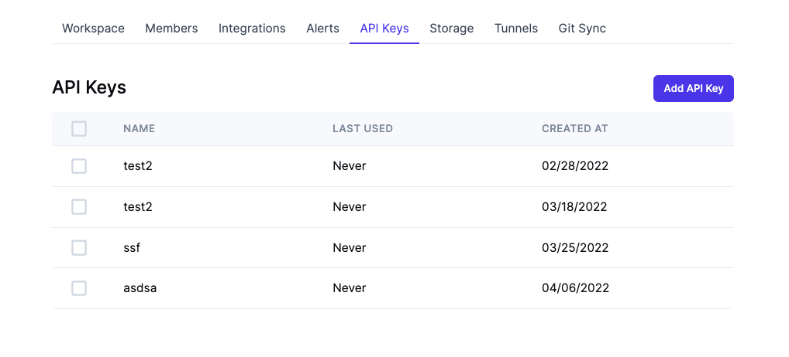
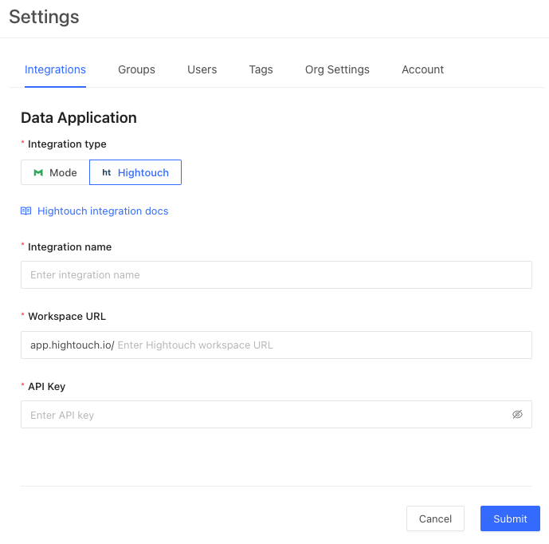
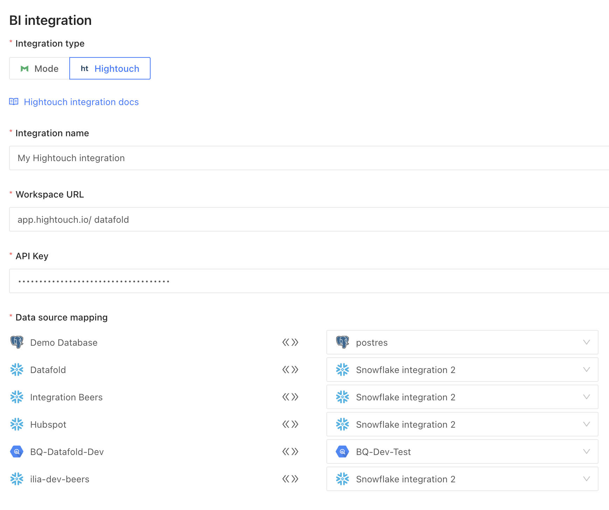

## Connecting Hightouch to Datafold

To install the Hightouch integration, navigate to **Admin** -> **Settings** -> **Data Applications** and click on the **Add New Integration** button.

Select **Hightouch** as your integration and click **Create**.

### Generate an API Key in Hightouch
To complete this integration you'll need to access your [Hightouch account](https://app.hightouch.io/) and navigate to **Settings** -> **API Keys** -> **Add API Key** to generate a new, unique API key for Datafold to use. 
:::caution
Your API key will appear only once, so please copy and save it to your password manager for further use.
:::

### Copy Hightouch Workspace URL

Then, grab your workspace URL, by navigating to **Settings** -> **Workspace** -> **Workspace URL** or by finding the workspace name in the search bar (`https://app.hightouch.io/<workspace_name/>`).

### Configure in Datafold
To configure in Datafold, start by creating an **Integration Name**. This is an identifier used in Datafold to uniquely identify this integration. 

Then, enter your **Workspace URL** and the **API Key** gathered from Hightouch.

#### Match Hightouch Data Sources to Datafold
When the correct credentials are entered we will begin to populate data sources in Hightouch (on the left side) that will need to be mapped to data sources configured in Datafold (on the right side). 

When completed, click **Submit**.

It may take some time to sync all the Hightouch entities to Datafold and for Lineage to populate. When completed your Hightouch models and sync will appear in Catalog as search results and Hightouch sources in data sources filter.

### Uninstall a Hightouch Integration
To uninstall a Hightouch integration:

* Remove the integration from Datafold by navigating to **Settings** -> **Data Applications** and clicking on the integration that you wish to remove. Click **Delete** to complete the removal.