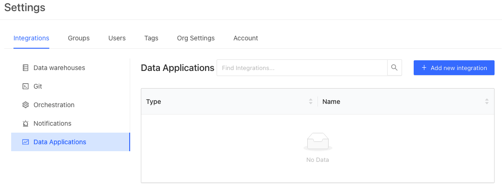
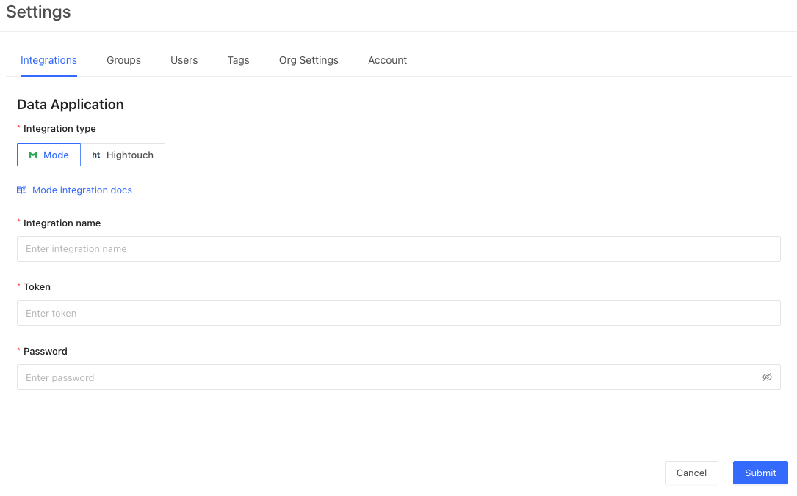

## Connecting Mode to Datafold

:::info

To complete this integration your Mode account must be a part of a Mode Business Workspace in order to generate an API Token. 

:::

To install the Mode integration, navigate to **Admin** -> **Settings** -> **Data Applications** and click on the **Add New Integration** button.

Select **Mode** as your integration and click **Create**.

### Generate an API Token and Password in Mode
To complete the configuration, follow [these steps](https://mode.com/developer/api-reference/authentication/) to generate an API token and password in Mode. 

### Configure in Datafold

Back in Datafold, we will enter an **Integration Name** (a name used to identify this integration in Datafold) and the **Token** and **Password**
generated in the previous step. 

Click **Submit** when the details are correctly entered. 

It can take some time to fetch all the reports, depending on the number of reports, but soon after they will begin to populate in the Datafold Lineage.

### Uninstall a Mode Integration
To uninstall a Mode integration:

* Remove the integration from Datafold by navigating to **Settings** -> **Data Applications** and clicking on the Mode integration that you wish to remove. Click **Delete** to complete the removal.
