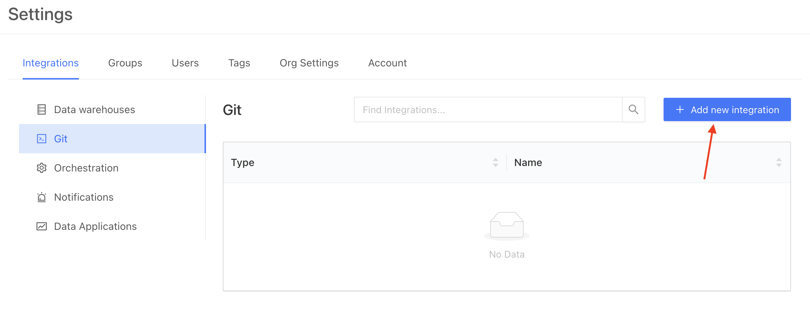
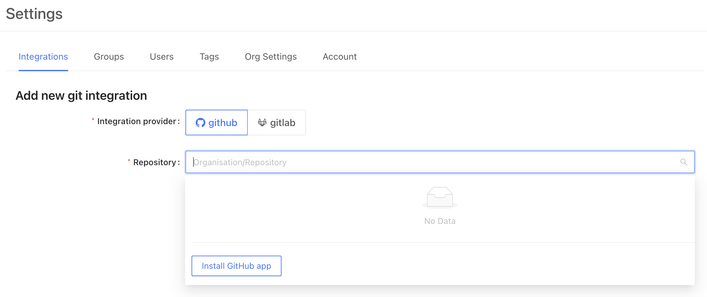

# GitHub

:::caution
If you are on an on-prem deployment, you should first create a GitHub App for the integration. See [GitHub integration for Datafold on-prem](on-prem/content/github_on-prem.md) before proceeding with this tutorial.
:::

To begin, navigate to **Admin** -> **Settings**. Then, click on Git in the sidebar to configure a new GitHub integration.

To set up a new integration click on the repository field to access the **Install GitHub app** button.

From here, GitHub will redirect you to login to your account and choose which organization you would like to connect. After choosing the right organization, you may choose to allow access to all repositories or specific ones. 

When complete, you'll be redirected back to Datafold, where you can choose the appropriate repository for connection. 

To complete the setup, click **Save**!
