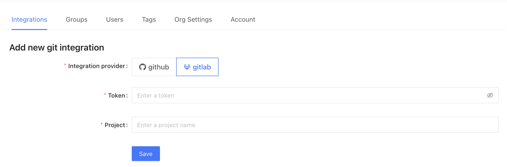

# GitLab

To begin, navigate to **Admin** -> **Settings**. Then, click on Git in the sidebar to configure a new GitHub integration.

To set up a new integration select the **GitLab** button.

To get the [project access token](https://docs.gitlab.com/ee/user/project/settings/project\_access\_tokens.html), navigate to your GitLab project settings and create a new token. Project access tokens are preferred over personal tokens for security.

Datafold requires the **Maintainer** role and **API** access. 

Finally, navigate back to Datafold and enter the **Project Token** and the name of your **project** before hitting **Save**. 