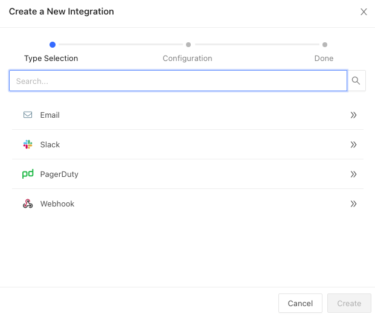
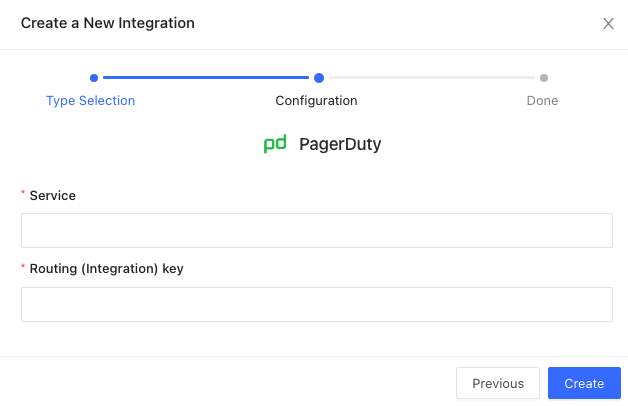

## Connecting PagerDuty for Datafold Alerts

:::info

To complete this integration you must have a PagerDuty role of **User**, **Admin**, **Manager**, **Global Admin**, or **Account Owner**.

:::

To connect PagerDuty, navigate to **Admin** -> **Settings** -> **Notifications** and click on the **Add New Integration** button.

Select **PagerDuty** as your integration and click **Create**.

## Creating a service in PagerDuty
To complete the configuration you'll need to login to your PagerDuty account and follow steps to [create a service](https://support.pagerduty.com/docs/services-and-integrations#create-a-service) and [generate a new integration key.](https://support.pagerduty.com/docs/services-and-integrations#generate-a-new-integration-key)

When completed, enter your **Service Name** and **Integration key** into the configuration form and click **Create**.

## Uninstalling the PagerDuty Integration

To uninstall PagerDuty:

* Remove the PagerDuty subscriptions from all alerts.
* Remove the integration from Datafold by navigating to **Settings** -> **Notifications** and clicking on the PagerDuty account that you wish to remove. Click **Delete** to complete the removal. 

## Subscribing to alerts
With this PagerDuty integration established, you can now send alerts directly to PagerDuty and trigger an escalation automatically. 

To configure:
- Navigate to the alert you wish to subscribe to
- Click on the **Add Subscription** button
- Select **PagerDuty** from the drop down menu

