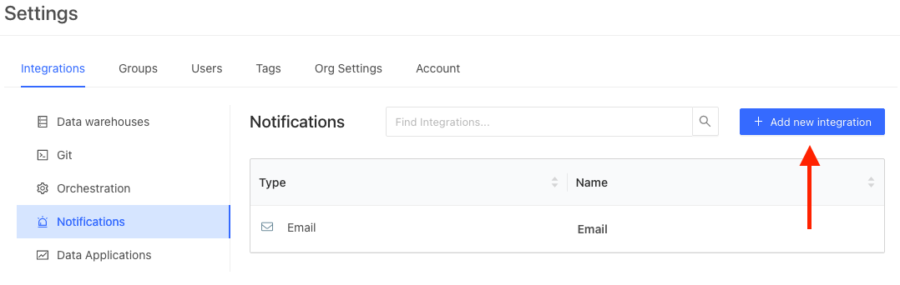

# Configure Webhooks for Datafold Alerts
:::info

This feature is only available on request. Please contact Datafold at [support@datafold.com](mailto:support@datafold.com) to enable it for your organization.
:::

To create a webhook destination, navigate to **Admin** -> **Settings** -> **Notifications**, click **Add New integration** and select **Webhook**. 

Configure the webhook with the following information:

| Field | Description |
| -------- | -------- |
| Name | The name of the webhook is used as an identifier in Datafold. |
| HTTP Method | Which type of HTTP method you'd like sent to your webhook. |
| URL to Call | The URL endpoint where you'd like the query sent. |
| HTTP Headers | Headers that may be required for your URL endpoint. |
| HTTP Body Template | Customize the body of your webhook message with any details or information that would be helpful. |
| Secret 1 & Secret 2 | Use for API tokens, passwords, or secrets that may be required for your webhook. |

You can use the following variables in the **Headers** and **Body** of your webhook:

| Variable | Description |
| -------- | ----------- |
| `{{id}}` | The id of the alert query. |
| `{{url}}`| The URL of the alert query. |
| `{{name}}` | The name of the alert query. |
| `{{status}}` | The status of the alert query: "triggered" (the violation or anomaly was detected) and "error" (the query execution has failed).|
|`{{secret1}}` & `{{secret2}}` | The value of the secret fields in the webhook setup. |

Once the integration is finished, it will be available for all users to use in the alert subscriptions:

<!-- .png>) -->