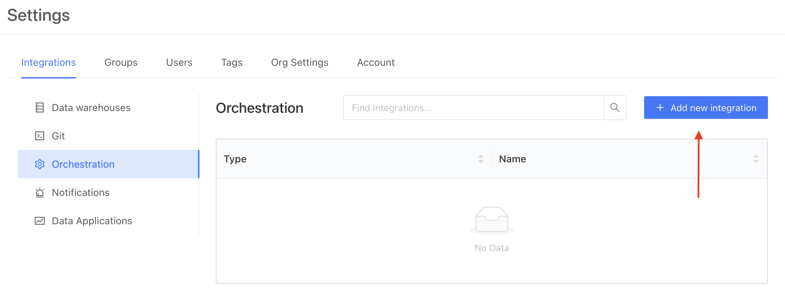
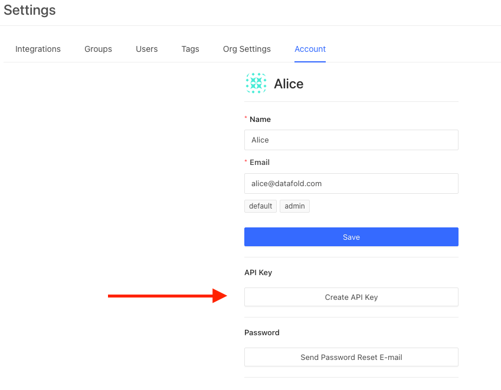

# datafold-sdk
### Prerequisites
- To use the datafold sdk you must first connect a [Data Source](integrations/data_warehouses/dw_overview.md) and connect a [GitHub](/integrations/git/github.md) or [GitLab](/integrations/git/gitlab.md) account.

### Steps to complete
- [Configure **datafold-sdk** on Datafold](datafold-sdk.md#configure-datafold-sdk-on-datafold)
- [Generate a Datafold API Key](datafold-sdk.md#generate-a-datafold-api-key)
- [Install **datafold-sdk**](datafold-sdk.md#install-datafold-sdk)

* To set up datafold-sdk begin by navigating to **Admin** -> **Settings** -> **Orchestration**. Here you will click on **Add New Integration** to configure the settings. 



### Configure datafold-sdk on Datafold
After selecting datafold-sdk from the available options, complete configuration with the following information:

| Field Name      | Description |
| ----------- | ----------- |
| Repository | Select the repository that generates the webhooks and where pull / merge requests will be raised. |
| Data Source | Select the data source where the code that is changed in the repository will run.|
| Name | An identifier used in Datafold to identify this CI configuration |
| Files to ignore | If defined, the files matching the pattern will be ignored in the PRs. The pattern uses the syntax of .gitignore. Excluded files can be re-included by using the negation; re-included files can be later re-excluded again to narrow down the filter. For example, to exclude everything except the `/dbt` folder, but not the dbt `.md` files, do:`*!dbt/*dbt/*.md`|
| Mark the CI check as failed on errors | If the checkbox is disabled, the errors in the CI runs will be reported back to GitHub/GitLab as successes, to keep the check "green" and not block the PR/MR. By default (enabled), the errors are reported as failures and may prevent PR/MRs from being merged. |
| Require the `datafold` label to start CI | When this is selected, the Datafold CI process will only run when the 'datafold' label has been applied. This label needs to be created manually in GitHub or GitLab and the title or name must match 'datafold' exactly. |
| Sampling tolerance | The tolerance to apply in sampling for all data diffs |
| Sampling confidence | The confidence to apply when sampling |
| Sampling Threshold | Sampling will be disabled automatically if tables are smaller than specified threshold. If unspecified, default values will be used depending on the Data Source type. |

### Generate a Datafold API Key
To generate a Datafold API key, navigate to **Admin** -> **Settings** -> **Account**. 

Here, click on the **Create API Key** button. This will generate and store an API key for your account. You will be able to view, copy, and regenerate this key at any time. 



### Install datafold-sdk

The [datafold-sdk](https://pypi.org/project/datafold-sdk/) allows you to integrate Datafold in your CI with arbitrary pipeline orchestrators. You can trigger diff and alerts from the command-line and implement CI jobs and procedures using **datafold-sdk**.

To use locally, begin by installing **datafold-sdk**:
```bash
pip install datafold-sdk
```
### Helpful Guides for datafold-sdk in CI
* [CI Overview](/guides/ci_guides_overview.md)
* [dbt Core](/guides/ci_guides/dbt_core.md)
* [CircleCI](/guides/ci_guides/dbt_core/circleci.md)
* [Github Actions](/guides/ci_guides/dbt_core/github_actions.md)
* [Gitlab CI](/guides/ci_guides/dbt_core/gitlab_ci.md)
