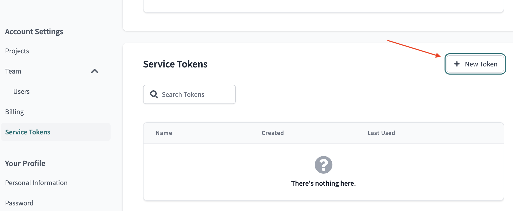
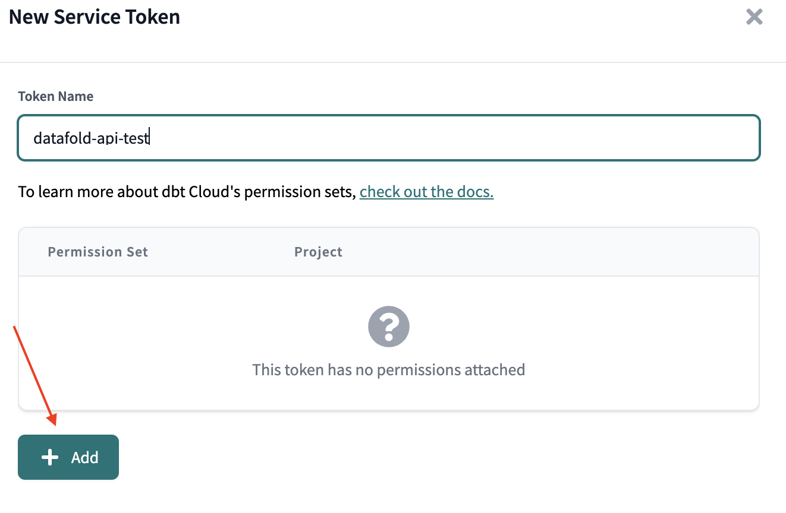
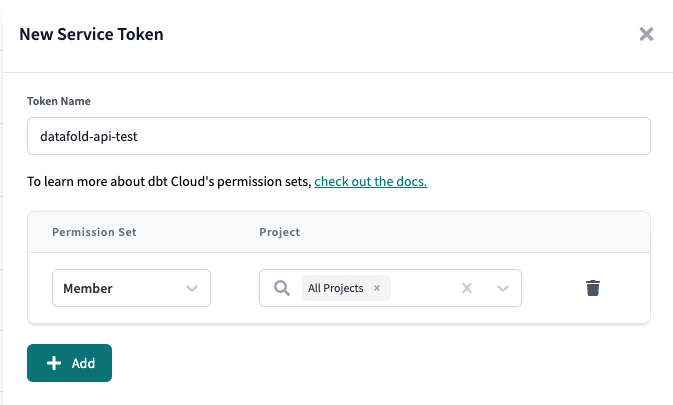
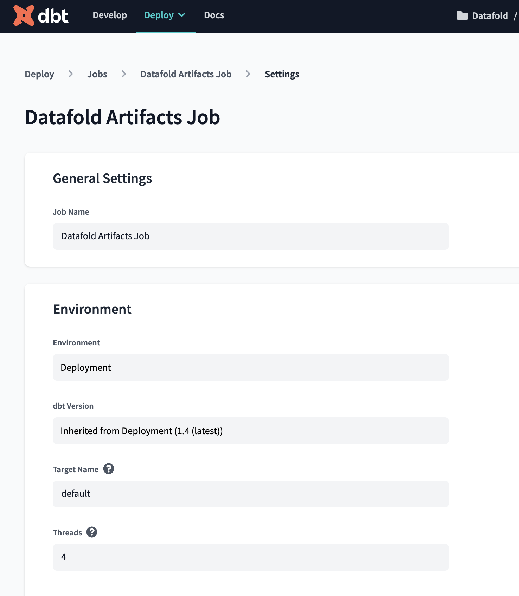
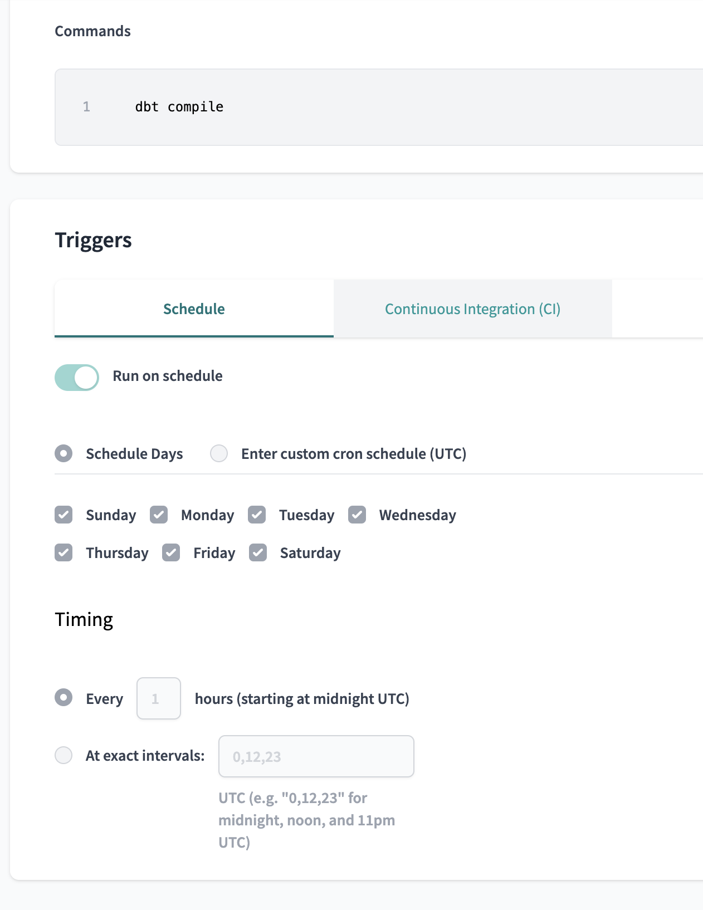
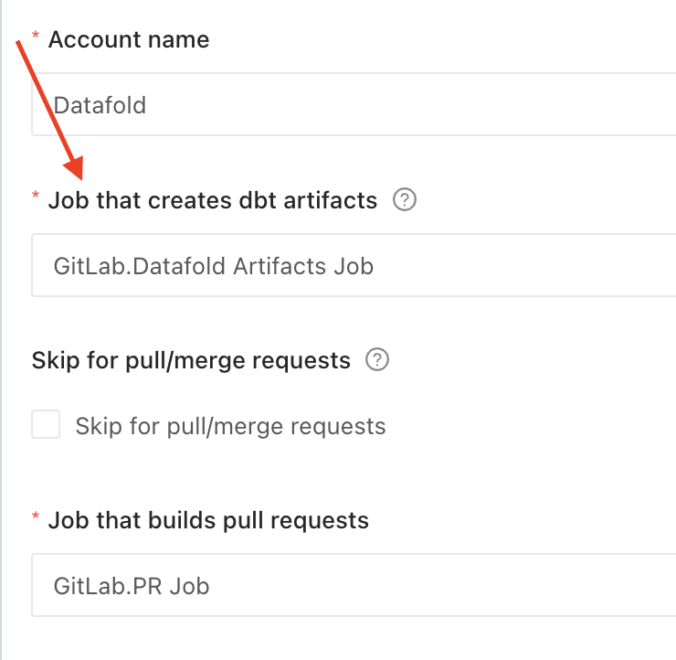

# Prerequisites

- To configure dbt Cloud, you must first connect a [Data Source](integrations/data_warehouses/dw_overview.md) and connect a [GitHub](/integrations/git/github.md) or [GitLab](/integrations/git/gitlab.md) account.
- You will need a dbt **Team** account or higher to access the dbt API Datafold.

## Connect your accounts using a token
- You will need either a [Service Token](https://docs.getdbt.com/docs/dbt-cloud-apis/service-tokens) or a [User Token](https://docs.getdbt.com/docs/dbt-cloud-apis/user-tokens):
    - **Service Token (Recommended):** 
        - Navigate to **Account Settings -> Service Tokens -> + New Token**   
               
            
            - Add a Token Name
            - Add a Permission Set   
                   
                - Permission Set: Member
                - Project: All Projects, or check only the projects to use with Datafold
                - Save   
                   
    - **User Token:**
        - Navigate to **Your Profile -> API Access**
            - Copy

## Set up dbt Cloud CI
In dbt Cloud, [set up dbt Cloud CI](https://docs.getdbt.com/docs/deploy/cloud-ci-job) so that your Pull Request job runs when you open or update a Pull Request.

dbt Cloud CI requires you to create at least two dbt Cloud jobs: a Production job and a Pull Request job. To integrate with Datafold, you may need to create additional jobs, which are described below.

## Create an Artifacts Job to provide Datafold with dbt Artifacts

We recommend creating a job in dbt Cloud that sends production artifacts (the `manifest.json` file) to Datafold on a regular basis. This is the easiest way to get started with Datafold.

    <h5>info Continuous Deployment</h5>

[creating a Merge Trigger Production Job](../../../guides/ci_guides/dbt_cloud.md#merge-trigger-production-job) using a tool like GitHub Actions.

### Artifacts Job

An Artifacts Job is a dbt Cloud job that executes a `dbt compile` command on an hourly basis. 

Select this job as the "Job that creates dbt artifacts" when setting up your dbt Cloud Integration.

