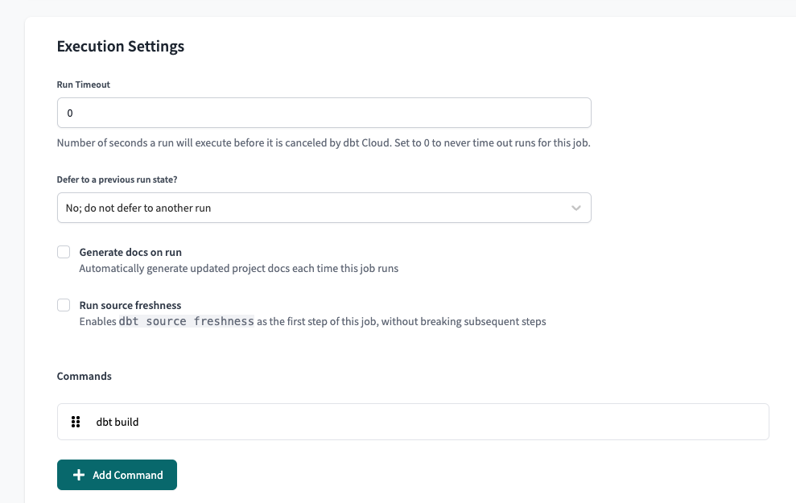
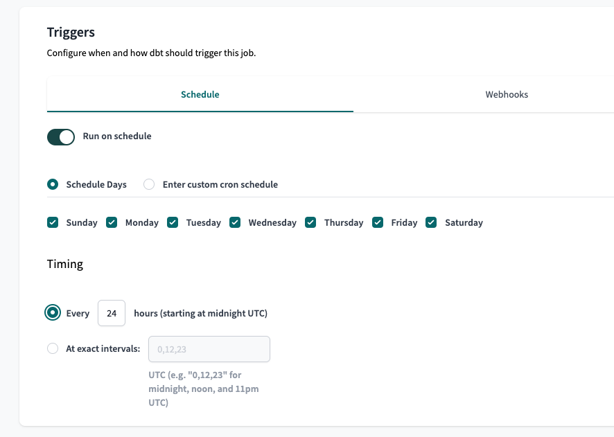

# Prerequisites

- To configure dbt Cloud, you must first connect a [Data Source](integrations/data_warehouses/dw_overview.md) and connect a [GitHub](/integrations/git/github.md) or [GitLab](/integrations/git/gitlab.md) account.
- You will need a dbt **Team** account or higher to access the dbt API Datafold.

## Connect your accounts using a token
- You will need either a [Service Token](https://docs.getdbt.com/docs/dbt-cloud-apis/service-tokens) or a [User Token](https://docs.getdbt.com/docs/dbt-cloud-apis/user-tokens):
    - **Service Token (Recommended):** 
        - Navigate to **Account Settings -> Service Tokens -> + New Token** <br/><br/>
             <br/><br/>
            
            - Add a Token Name
            - Add a Permission Set <br/><br/>
                 <br/><br/>
                - Permission Set: Member
                - Project: All Projects, or check only the projects to use with Datafold
                - Save <br/><br/>
                 <br/><br/>
    - **User Token:**
        - Navigate to **Your Profile -> API Access**
            - Copy

## Set up dbt Cloud CI
In dbt Cloud, [set up dbt Cloud CI](https://docs.getdbt.com/docs/deploy/cloud-ci-job) so that your Pull Request job runs when you open or update a Pull Request.

dbt Cloud CI requires you to create at least two dbt Cloud jobs: a Production job and a Pull Request job. To integrate with Datafold, you may need to create additional jobs, which are described below.

### Production Job
Create a scheduled job (e.g., every 24 hours) in dbt Cloud.
* **Why?**
    * To refresh models every night.
    * Table models should be rematerialized with fresh data.

* Navigate to Jobs > Settings > Execution Settings
* Under Commands, add a `dbt build` command:



* Navigate to Jobs > Settings > Triggers > Schedule
* Select "Run on schedule"
* Complete the scheduling form for your desired schedule:



### Pull Request Job
Create a job that runs when pull requests are opened.

* **Why?**
    * To run and test pull request changes before deploying to production.
    * Changes are deployed to a test environment during review.


* Navigate to Jobs > Settings > Execution Settings
* Under Commands, add a `dbt build` command:


* Navigate to Jobs > Settings > Triggers > Webhooks
* Check "Run on Pull Requests?"


### Merge Trigger Production Job
We recommend creating a job that triggers a dbt Cloud production run when changes are pushed to main.

Then, select this job as the "Job that creates dbt artifacts" when setting up your dbt Cloud Integration.

```mdx-code-block
import DbtArtifacts from '../../../../static/img/job_that_creates_artifacts.png';

```
<center></center>

* **Why?**
    * To deploy new changes from pull requests immediately.
    * This will keep production up to date and enable accurate Datafold diffs.
    * By default, dbt Cloud runs the production job on a schedule, not on merges.


Example [Github Action](../../../guides/ci_guides/dbt_core/github_actions.md):
```yml
name: Trigger dbt Cloud

on:
  push:
    branches:
      - main

jobs:
  run:
    runs-on: ubuntu-20.04
    timeout-minutes: 15

    steps:
      - name: checkout
        uses: actions/checkout@v2

      - name: Trigger dbt Cloud job
        run: |
          output=$(curl -X POST --fail \
            --header "Authorization: Token ${DBT_API_KEY}" \
            --header "Content-Type: application/json" \
            --data '{"cause": "Commit '"${GIT_SHA}"'"}' \
            https://cloud.getdbt.com/api/v2/accounts/${ACCOUNT_ID}/jobs/${JOB_ID}/run/)

          echo "Triggered dbt Cloud run at:"
          echo ${output} | jq -r .data.href
        env:
          DBT_API_KEY: ${{ secrets.DBT_API_KEY }}
          ACCOUNT_ID: 1234 # dbt account id
          JOB_ID: 4567 # dbt job id of the production tables
          GIT_SHA: "${{ github.ref == 'refs/heads/master' && github.sha || github.event.pull_request.head.sha }}"
```
You need to add the dbt Cloud API key as a secret in GitHub Actions, and you need to set the IDs of the account and the job id that builds the production job. You can find these easily in the dbt Cloud UI:


### Artifacts Job

If you do not set up a Merge Trigger Production Job, we recommend creating a dedicated job that executes a `dbt compile` command on an hourly basis. Then, select this job as the "Job that creates dbt artifacts" when setting up your dbt Cloud Integration.


<center></center>