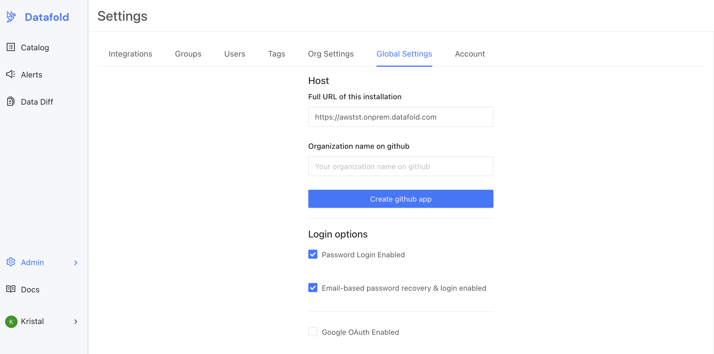

# On-premise Deployment with GitHub

:::info

On-prem deployments are an Enterprise feature. Please email [sales@datafold.com](mailto:sales@datafold.com) to enable your account. 

:::

**Steps to complete:**

1. [Create GitHub Application](github_on-prem.md#create-github-application)
2. [Configure GitHub in Datafold](github_on-prem.md#configure-github-in-datafold)

## Create GitHub Application

On-prem clients of Datafold need to create their own GitHub app, rather than use the shared Datafold GitHub application.

To begin, navigate to **Admin** -> **Settings** -> **Global Settings**.

To begin the set up process, enter the domain that was registered for the on-prem deployment in [AWS](../content/vpcs/aws.md) or [GCP](../content/vpcs/gcp.md). Then, enter the name of the GitHub organization where you'd like to install the application. When filled, click **Create GitHub App**. 

This will redirect the admin to GitHub, where they may need to authenticate. **The GitHub user must be an admin of the GitHub organization.**

After authentication, you should be directed to enter a description for the GitHub App. After entering the description, click **Create Github app**.

Once the application is created, you should be returned to the Datafold settings screen. The button should then have disappeared, and the details for the GitHub App should be visible.

## Configure GitHub in Datafold

If you see this screen with all the details, you've successfully created a GitHub App! Now that the app is created, you have to install it using the [GitHub integration setup](../../integrations/git/github.md).
