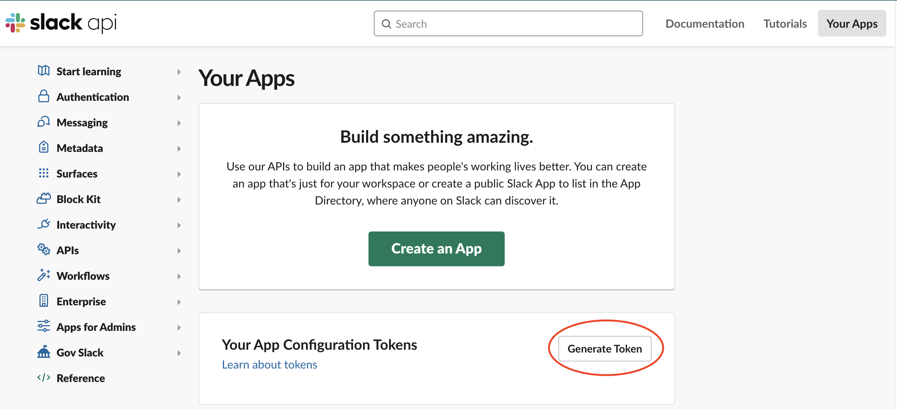

# On-premise Deployment with Slack

:::info

On-prem deployments are an Enterprise feature. Please email [sales@datafold.com](mailto:sales@datafold.com) to enable your account. 

:::

**Steps to complete:**

1. [Create a Slack Application](slack_on-prem.md#create-a-slack-app)
2. [Configure Slack in Datafold](slack_on-prem.md#configure-slack-in-datafold)

## Create a Slack App

On-prem clients of Datafold need to create their own Slack app, rather than use the shared Datafold Slack application.

To begin, navigate to **Admin** -> **Settings** -> **Global Settings**. After scrolling down the page, you'll arrive at the Slack configuration.

Then, click the **Create a Slack app configuration token**. You will be redirected to Slack, where you will be prompted to create a slack app or generate a token. Here, click **Generate Token**.

Copy the token and paste it into the configuration form in Datafold. Then, click **Create Slack App**.

The `client id`, `secret`, and `signing secret` will auto-populate to complete the connection. 

## Configure Slack in Datafold

With the Slack App creation completed, you can proceed on to the [Slack integration setup](../../integrations/notifications/slack.md).

:::note
The Slack App is set to **Not distributed,** meaning that it is only accessible to the Datafold instance running on-prem.
:::