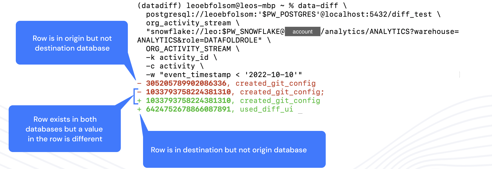

#### data-diff enables data professionals to detect differences in values between any two tables. 
It's fast, easy to use, and reliable. Even at massive scale.

[Join us on GitHub](https://github.com/datafold/data-diff) if you'd like to contribute to this open source library!

## How to use

### Diff Tables Between Databases
#### Quickly identify issues when migrating data between databases

### Diff Tables Within Databases (available in pre release)
#### Improve code reviews by identifying data problems you don't have tests for
<iframe width="640" height="414" src="https://www.loom.com/embed/682e4b7d74e84eb4824b983311f0a3b2" frameborder="0" webkitallowfullscreen mozallowfullscreen allowfullscreen></iframe>

### Here's a list of amazing things `data-diff` can do!

* ⇄  Verifies across [many different databases](./how_to_use#databases-we-support-and-how-to-connect) (e.g., PostgreSQL ⇄ Snowflake) or within a database
* 🔍 Outputs [diff of rows](#example-command-and-output) in detail
* 🚨 Simple CLI/API to create monitoring and alerts
* 🔁 Bridges column types of different formats and levels of precision (e.g. Double ⇆ Float ⇆ Decimal)
* 🔥 Verify 25M+ rows in <10s, and 1B+ rows in ~5min.
* ♾️  Works for tables with 10s of billions of rows

Read more about our [common use cases](./common_use_cases), or jump right in and [install data-diff](./how_to_install) and run your first diff.