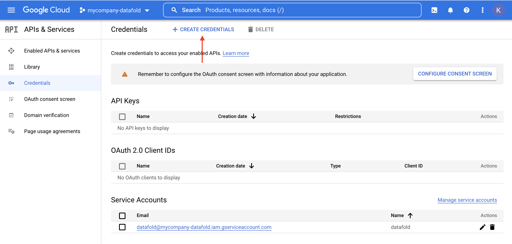
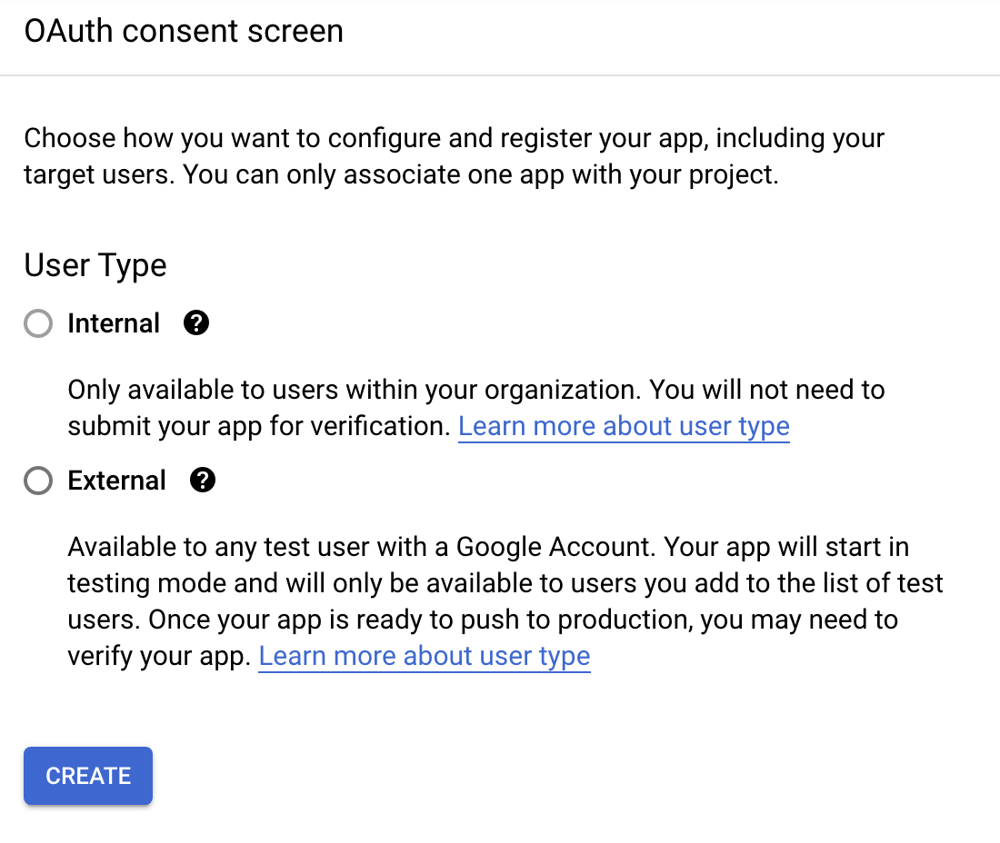
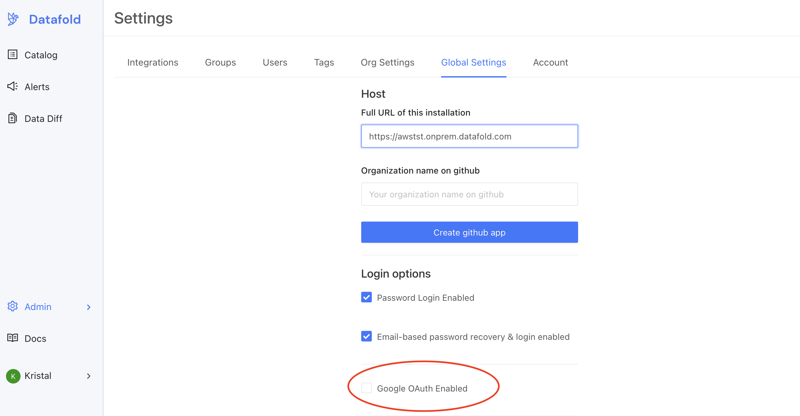

# Setting up Google OAuth on Datafold

**Steps to complete:**

* [Create an OAuth Client ID](google_oauth.md#create-oauth-client-id)
* [Configure Google OAuth in Datafold](google_oauth.md#configure-google-oauth-in-datafold)

## Create OAuth Client ID
To begin, navigate to the Google admin console for your organization: [https://console.cloud.google.com/apis/credentials](https://console.cloud.google.com/apis/credentials?authuser=1\&folder=\), click **Create Credentials** and select **OAuth Client ID**.

:::tip
To configure OAuth you may need to first configure your consent screen. We recommend selecting **Internal** to keep access limited to users in your Google workspace and organization. 

:::

To configure OAuth:
* **Application type**: "Web application"
* **Authorized JavaScript origins**: `https://<your.domain.name>`
* **Authorized redirect URIs**: `https://<your.domain.name>/oauth/google`

Finally, click **Create**. You will see a set of credentials that you will copy over to your Datafold Global Settings. 

## Configure Google OAuth in Datafold
To finish the configuration you will paste in the OAuth credentials in your Datafold Global Settings. 

To begin, navigate to **Admin** -> **Settings** -> **Global Settings**. When scrolling down on the page you'll see a check box for **Google OAuth Enabled**.

Clicking the checkbox will reveal two additional fields. In the first, enter the **domain** or URL of your OAuth client ID and in the second, paste in your **Client Secret**.

When completed, scroll all the way down the page to click **Save**.