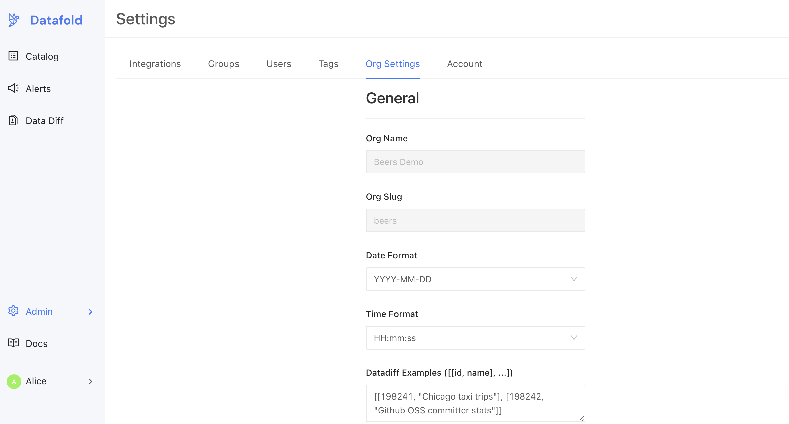

# Configuring authentication with Okta

**Steps to Complete**
1. [Create Okta Integration in Datafold](okta.md#create-okta-integration-in-datafold)
2. [Create Okta App Integration](okta.md#create-okta-app-integration)
3. [Configure Okta in Datafold](okta.md#configure-okta-in-datafold)
4. [Set Up Okta-initiated Login](okta.md#set-up-okta-initiated-login)

Okta SSO is available for both SaaS and on-premise installations of Datafold.

## Create Okta Integration in Datafold

To begin the integration, navigate to **Admin** -> **Settings** -> **Org Settings** in Datafold. 

Scroll down the page a bit to find the **Okta** section.

## Create Okta App Integration
:::info
Creating an App Integration in Okta may require admin privileges.
:::

Next, log in to Okta interface and navigate to **Applications** and click **Create App Integration**. 

Then, in the configuration form, select **OpenId Connect (OIDC)** and **Web Application** as the Application Type.

In the following section, you will set:
- **App integration name**: A name to identify the integration. We suggest you use `Datafold`.
- **Grant type**: Should be set to `Authorization code` automatically.
- **Sign-in redirect URI**: 
    - For standard **SAAS installations of Datafold**,the redirect URL should be `https://app.datafold.com/oauth/okta/<client-id>`, where client-id is the Client ID of the configuration. 
    :::caution
    You will be given the Client ID after saving the integration and need to come back to update the client ID afterwards.
    :::
    -  For **on-premise Datafold installations**, the redirect URL should be: `https://<install-hostname>/oauth/okta`

On the next screen, you'll be presented with Client ID and Client Secret. You will need these to configure Okta in Datafold.

## Configure Okta in Datafold
In Datafold, navigate back to **Org Settings** where we began. 
- Paste in your Okta **Client ID** and **Client Secret**. 

- The **metadata URI** of Okta OAuth server is `https://<okta-server-name>/.well-known/openid-configuration` where `okta-server-name` is your Okta domain.

- If you'd like to auto-create users in Datafold that are authorized in Okta, select the **Autocreate Users** checkbox.

When completed, click **Save**.

## Set Up Okta-initiated login
:::tip
Organization admins will always be able to log in with either password or Okta. Non-admin users will be required to log in through Okta once configured.
:::

Users in your organization can log in to the application directly from the Okta end-user dashboard. To enable this feature, configure the integration as follows:

1. Set **Login initiated by** to `Either Okta or App`.
2. Set **Application visibility** to `Display application icon to users`.
3. Set **Login flow** to `Redirect to app to initiate login (OIDC Compliant)`.
4. Set **Initiate login URI**:
   * **For on-premise deployment:** `https://<install-hostname>/login/sso/<client-id>?action=<action>`
     * client-id is the Client ID of the configuration, and 
     * action is `signup` if you enabled users auto-creation, or `login` otherwise.
   * **For SaaS:** `https://app.datafold.com/login/sso/<client-id>?action=<action>`
     * client-id is the Client ID of the configuration, and 
     * action is `signup` if you enabled users auto-creation, or `login` otherwise.

