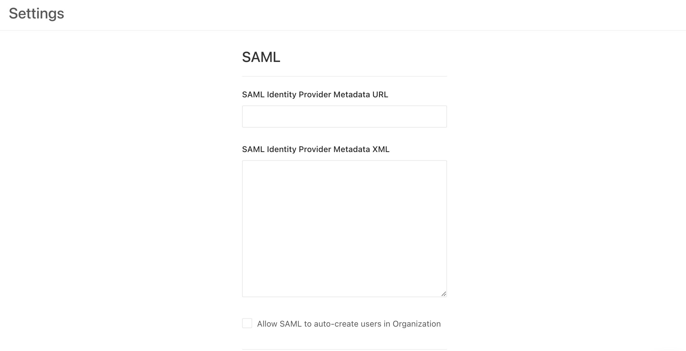

# SAML

SAML (Security Assertion Markup Language) is a protocol for authenticating users with arbitrary Identity Providers to access Service Providers. In this case, Datafold (either SaaS or on-premise) is the service provider. The Identity Providers can be anything used by the organization, e.g. Google, Okta, Duo, etc.

## Generic SAML Identity Providers

To configure a SAML provider:

1. In the organization's Identity Provider, create a **SAML application** (sometimes called a **single sign-on** or **SSO** method).

The Identity Provider will show the **Identity Provider metadata XML**. It may be presented as raw XML, a URL to the XML, or a XML file to download.

:::info
The Identity Providers sometimes provide additional parameters, such as SSO URLs, ACS URLs, SLO URLs, etc. We gather this information from the XML directly so these can be safely ignored.
:::

2. In Datafold, navigate to **Admin** -> **Settings** ->  **Org Settings** and scroll down to the **SAML** section.

3. In the SAML fields, paste the Identity Provider metadata XML into the **SAML Identity Provider Metadata XML** field or paste the metadata URL from your Identity Provider.

4. Click **Save**. The XML will be validated after saving. Once saved, a few read-only fields will show the Service Provider URLs specific to your organization.

5. Copy and paste the generated Service Provider URLs from Datafold into the Identity Provider's application setup. The only two mandatory fields are **Service Provider Entity ID** and the **Service Provider ACS URL**.

If you have the option, enabled the SAML Response signature and set it to **whole-response signing**.

6. In your Identity Provider activate the SAML application for all users or for select groups.

With SAML configured, the SAML login button will be available for Datafold users in your organization. 

- For standard SaaS users, Datafold users must be   created and invited from the organization in Datafold before logging in with SAML for the first time.

- For on-premise organizations, the org admins can turn on the **Auto-create users for SAML logins** checkbox from the **Org Settings** in Datafold. If enabled, the SAML login button will be enabled always, and all authenticated users will be automatically created in Datafold.

## Google as a SAML Identity Provider

Please follow this Google manual: [Set up your own custom SAML application](https://support.google.com/a/answer/6087519?hl=en). 

:::caution
You need to be a **super-admin** in the Google Workspace to configure a SAML application.
::: 

- Begin by clicking **Downloading metadata** in the left sidebar and follow the steps to [setup a SAML identity provider](saml.md#generic-saml-identity-providers)
- Paste in the **ACS URL** and **Entity ID** as provided by Datafold.
- Select **Email** as the Name ID format.
- Select **Basic Information > Primary email** as the Name ID.
- Click **Save**.

- Next, configure the attribute mapping as follows:
    - **First Name** -> `first_name`
    - **Last Name** -> `last_name`

